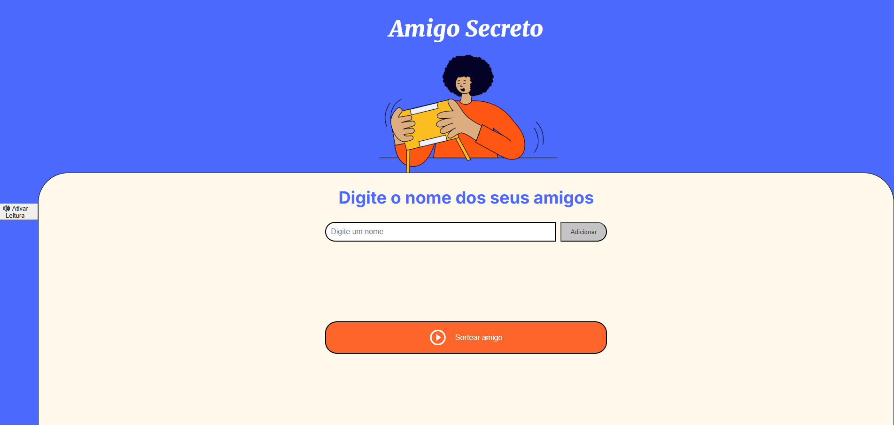

<div align="center">
  <h1>🎁Amigo Secreto - Sorteio Inteligente</h1>
  
  <br>
  <em>Desenvolvido com mentoria dos cursos de Formação em Lógica de Programação da Alura.</em>
</div>

---
## 📝 Descrição do Projeto

Aplicação que permite aos usuários inserir nomes de amigos em uma lista para, em seguida, realizar um sorteio aleatório e determinar quem é o "amigo secreto". Com **validações robustas** e **acessibilidade integrada**, garante sorteios justos e inclusivos, seguindo as melhores práticas de desenvolvimento web.

---
## 🌟 Destaques Exclusivos  

### 🛡️ Sistema de Validação Avançado  
- 🔢 **Bloqueio de números** em nomes  
- 🚫 **Impede entradas duplicadas**  
- ✅ **Mínimo de 2 participantes** obrigatório para sorteio  
- 🧹 **Auto-limpeza** do campo após adição  
- ⚠️ **Sistema de alertas** contextualizados:  
  - Entradas vazias  
  - Caracteres inválidos  
  - Tentativas de sorteio inválidas  

---
## 🧭 Como Utilizar

1. **Adicione participantes:**
   - 📝 Digite o nome no campo
   - ➕ Clique em "Adicionar" ou pressione Enter
   - 🔄 Repita até ter pelo menos 2 nomes

2. **Realize o sorteio:**
   - 🎲 Clique em "Sortear Amigo"
   - ⌛ Aguarde a animação do resultado

3. **Controles especiais:**
   - 🔊 Ativar/desativar leitura de tela
   - ❌ Clique no "X" para remover participantes
   - 🔄 Novo sorteio (disponível após ciclo completo)

---
## 🎰 Mecanismo de Sorteio  
✔ **Verifica** quantidade mínima de participantes  
🎲 **Gera** índice aleatório com `Math.random()`  
🔁 **Garante** não repetição até ciclo completo  
🎞️ **Exibe** resultado com animação  

---
## 🔄 Lógica de Sorteio Inteligente  

```javascript
// Garante ciclo completo de sorteios
const sortearAmigo = () => {
  const disponiveis = listaAmigos.filter(amigo => !nomesSorteados.includes(amigo));
  
  if (disponiveis.length === 0) {
    finalizarSorteio();
    return;
  }
  
  const indice = Math.floor(Math.random() * disponiveis.length);
  const sorteado = disponiveis[indice];
  nomesSorteados.push(sorteado);
  mostrarResultado(sorteado);
};
```
---
## 🚨 Sistema de Alertas  

| Tipo    | Ícone  | Situação                    |
|---------|--------|----------------------------|
| Erro    | ❌    | Nome inválido/duplicado     |
| Sucesso | ✅    | Nome adicionado             |

---
## ♿ Recursos de Acessibilidade  

| Recursos                | Descrição                                   | Ícone  |
|-------------------------|--------------------------------------------|--------|
| **Leitura de Tela**     | Suporte TTS integrado                      | 🔊     |
| **Alto Contraste**      | Paleta WCAG AA compliant                   | 🎨     |
| **Navegação por Teclado** | Totalmente acessível via teclado         | ⌨️     |
| **Design Responsivo**   | Adaptável a qualquer dispositivo           | 📱     |

---
## 🚀 Tecnologias Utilizadas  

| Tecnologia  | Descrição |
|------------|--------------------------------------------|
|  | Estrutura do projeto |
|  | Estilização e responsividade |
|  | Lógica de funcionamento |
|  | Leitura de tela integrada |

---
## ⚙️ Personalização

```javascript
// No arquivo config.js
const config = {
    maxParticipants: 20,         // Máximo de participantes
    ttsSpeed: 1.2,               // Velocidade da leitura em TTS
    animationDuration: 500,      // Tempo das animações (ms)
    allowSpecialChars: false,    // Permitir caracteres especiais nos nomes?
    darkMode: true,              // Habilitar modo escuro?
    soundEffects: true           // Habilitar efeitos sonoros?
};
```

---
## 📌 Pré-requisitos

- Navegador atualizado (Chrome 90+, Firefox 88+)
- JavaScript habilitado
- Microfone (opcional para TTS)

---
## 🤝 Contribuição

1. Faça um Fork do projeto
2. Crie sua Branch (git checkout -b feature/nova-feature)
3. Commit suas mudanças (git commit -m 'Adiciona nova feature')
4. Push para a Branch (git push origin feature/nova-feature)
5. Abra um Pull Request.

---
## 👨💻 Desenvolvedor
<div align="center"> 
  <a href="https://github.com/oriana0615"> 
     
    <br> <strong>Oriana Salazar</strong> 
  </a> 
  <br> 
  <a href="https://github.com/oriana0615"> 
     
  </a> 
</div>
